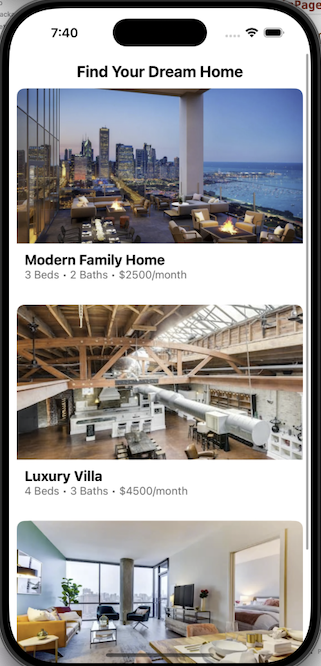

# Ownable

## **Author**

This document is created by Jatin

---

## **Purpose**

## **Image of Properties**

### **For Us**

- **Do Good**:
  - Incentive alignment with tenants (property care, rent, maintenance).
  - Premium rent over market price.
  - Lower vacancy with tenant interest.
  - Potential government support.
  - Streamlined exit with a potential buyer pool from tenants.
  - Promote ownership and grant opportunities – Wall Street Single Family Residences.

---

### **For Tenants**

- **Savings Match**:
  - Cash match of $5,000 – $10,000.
- **Build Financial Stability**:
  - Coaching, financial reporting, credit history building, and savings.
- **Long-Term Generational Wealth**:
  - Through property ownership.
- **Move-In Flexibility**:
  - Reduces moving expenses.
- **Try Before You Buy**:
  - Experience the neighborhood, lifestyle, and expenses before purchase.
- **Exposure to Market Upside**:
  - Access equity gains before ownership.

---

### **For Investors**

- Return on asset-backed risk profiles.
- Align investments with social good initiatives.
- Investments in affordable housing projects backed by city initiatives.
- Asymmetric upside by investing in a hybrid operating company/property company model.

---

## **Roadmap**

1. **Marketplace Platform**:

   - Eliminate traditional buying/selling brokers to reduce fees.
   - Build a vetted buyer pool.
   - Streamline the selling process to lower commissions from 9% to 4%.
2. **Tech-Enabled Management**:

   - Rental and listing portals for properties purchased.
   - Partnerships with mortgage lenders and insurance companies to reduce friction.
3. **Government Partnerships**:

   - Work with Chicago Housing Trust and the Department of Housing for accessibility and government backing.
   - Increase overall housing stock.
4. **Mortgage Safety Measures**:

   - Introduce forbearance options for larger safety nets.

---

## **Business Model**

### **Proposition of Profit**

1. **Example Investment**:

   - VC fund provides $5M.
   - Ownable buys 16 properties for $4.8M, with $200K in closing costs.
   - Rent collected: $2,500 per unit × 18 months × 16 units = $720,000.
2. **Revenue from Mortgages**:

   - 16 mortgages issued as servicer.
   - Revenue from interest (0.04 compounded) + loan origination fees.
3. **Additional Revenue**:

   - Profit per property sale ($5K per property × 16 properties) = $80,000.
   - Sale commission on mortgages (1% – 3% of value) = $50K – $75K.
4. **Total Profit**:

   - Estimated $905K minus operating expenses.

### **Additional Income Streams**

- 15% commission on insurance and contractor work.
- Materials assurance and dedicated market brokers.

---

---
